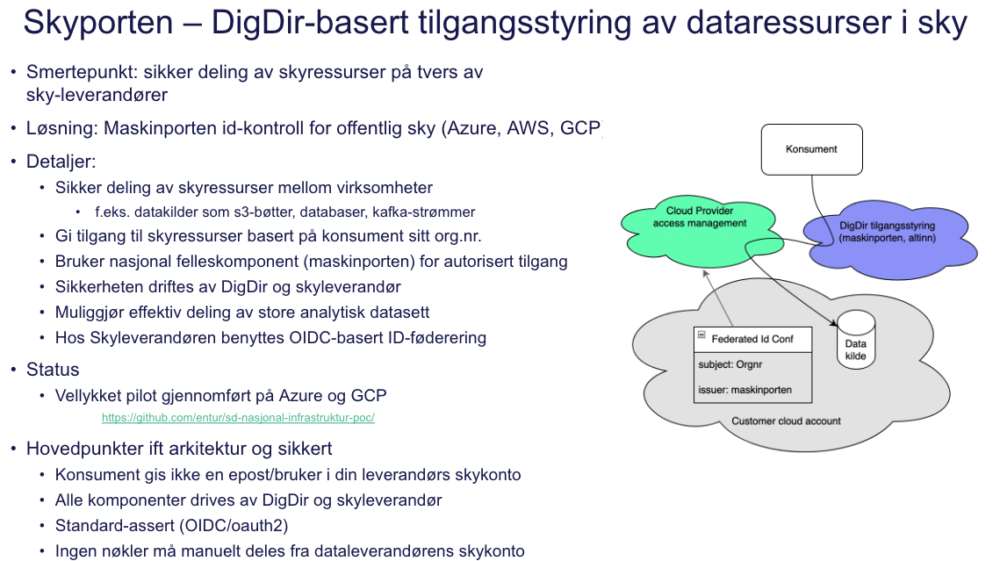
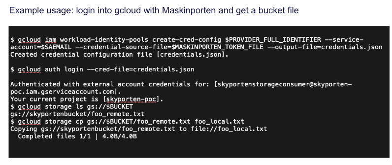
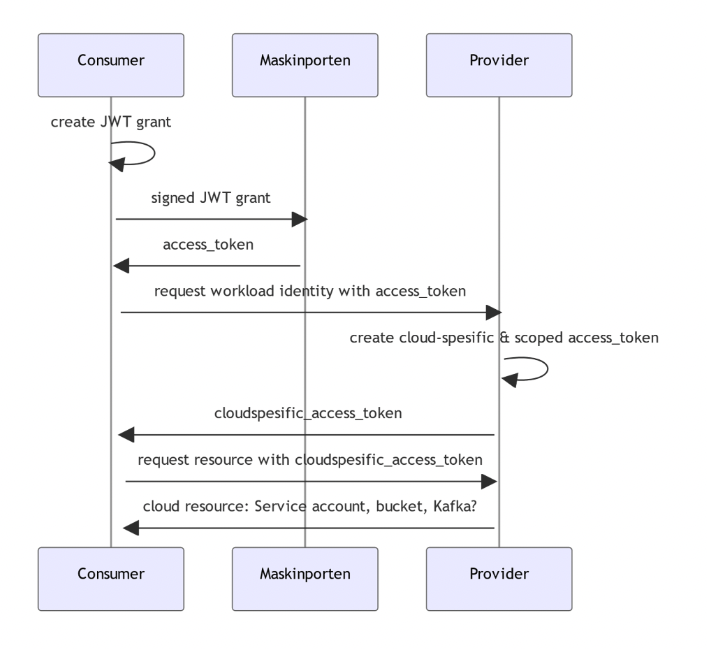

# Skyporten examples

## Skyporten – DigDir-basert tilgangsstyring av dataressurser i sky

Skyporten er i ferd med å settes i produksjon av DigDir. Implementasjonseksempler finnes her for:

* [GCP](gcp/cli)
* [Azure](azure)
* [AWS](aws/cli)

Eksempel på bruk av Skyporten i GCP:

Autoriseringsflyt:

## Oppsett

Prosjektet krever at man har et ekte Maskinporten-token mot deres testmiljø. For testformål ble dette opprettet gjennom helperen her https://github.com/entur/exploratory-maskinporten-token. 

Ta kontakt med kontakt@samferdselsdata.no om du vil ha hjelp til å komme igang.
