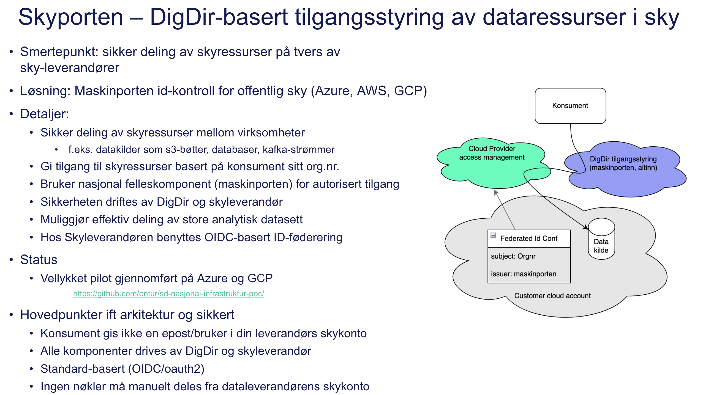

# Skyporten examples

## Skyporten – DigDir-basert tilgangsstyring av dataressurser i sky

Skyporten er i ferd med å settes i produksjon av DigDir. Implementasjonseksempler finnes her for:

* [GCP](gcp/cli)
* [Azure](azure)
* [AWS](aws/cli)

Eksempel på bruk av Skyporten i GCP:

Autoriseringsflyt:

## Oppsett

Prosjektet krever at man har et ekte Maskinporten-token mot det rette miljøet. Det finnes flere kodeeksempler som kan hjelpe deg i gang, se feks
* Digdirs eget [java-eksempel](https://github.com/felleslosninger/jwt-grant-generator)
* [node-eksemple](https://github.com/entur/exploratory-maskinporten-token)
* Nav sin [Maskinporten-client](https://github.com/navikt/maskinporten-client/tree/master)

Ta kontakt med kontakt@samferdselsdata.no om du vil ha hjelp til å komme igang.
